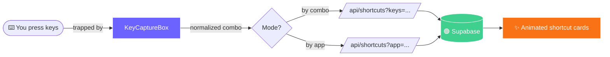

<!-- ============================ HEADER BANNER ============================ -->
<div align="center">


<!-- Typing animation -->
<a href="https://github.com/Eshwar02/leaaarrn-it">
  
</a>

<br/>

<!-- Badges -->


<br/>


</div>

<!-- ============================ MASCOT ============================ -->
<div align="center">


> _"i pressed Ctrl+Shift+N to learn it… and a whole incognito window jumped out at me."_
> — **every developer, once** 😼

</div>

---

## 🎬 What is this?

**leaaarrn-it** is a playground for keyboard shortcuts. Press a combo, and it tells you what that combo does — in Windows, macOS, Linux, Chrome, VS Code, Excel, Figma, and more. No more accidental incognito windows while you're just trying to *learn*.

<div align="center">

</div>

## ✨ Features

| | Feature | What it does |
|:--:|:--|:--|
| ⌨️ | **Key-Capture Box** | A huge, focusable box that **traps your keystrokes** so the browser never reacts. Big, bouncy, animated keycaps show exactly what you pressed. |
| 🔒 | **Full-Capture Mode** | Uses the **Keyboard Lock API** in fullscreen to trap even reserved combos like `Ctrl+Shift+N`, `Ctrl+T`, `Ctrl+W` — *zero* browser interference. |
| 🗂️ | **Browse by App** | A slick left sidebar groups every **OS, browser, and tool**. Click one to see its full shortcut list. |
| 🌍 | **Cross-Platform Notes** | Each shortcut shows how it differs on Windows / macOS / Linux. |
| 🎨 | **Delightful Animations** | Pop-in keycaps, pulsing glow, fire-flash — learning should *feel* good. |

<div align="center">

</div>

## 🧠 The "huge keyboard-proof box"

```
 ┌──────────────────────────────────────────────────────────┐
 │  🟢 Listening… press any shortcut                          │
 │                                                            │
 │        ╔═══════╗   +   ╔═══════╗   +   ╔═══════╗           │
 │        ║ Ctrl  ║       ║ Shift ║       ║   N   ║           │
 │        ╚═══════╝       ╚═══════╝       ╚═══════╝           │
 │                                                            │
 │   🔒 Enable full capture (Ctrl+Shift+N, Ctrl+T…)           │
 └──────────────────────────────────────────────────────────┘
```

> 💡 **Why does this exist?** Browsers refuse to let normal pages suppress
> reserved shortcuts (security). The only true escape hatch is the
> **Keyboard Lock API**, which works in **fullscreen on Chromium browsers**.
> Flip on _Full-Capture Mode_ and `Ctrl+Shift+N` finally behaves. 🎉

## 🗺️ How it works



## 🧰 Tech Stack

<div align="center">


</div>

## 🚀 Getting Started

```bash
# 1. Install
npm install

# 2. Configure — copy the example and fill in your Supabase keys
cp .env.local.example .env.local

# 3. Set up the database (Supabase SQL Editor)
#    → run supabase/schema.sql
#    → run supabase/seed.sql
#    → run supabase/seed_more_apps.sql   (PowerPoint, Slack, Photoshop, Notion, Gmail)

# 4. Fire it up 🔥
npm run dev
```

Then open **http://localhost:3000/explore** and start mashing keys. 😎

## 📦 Project Structure

```
leaaarrn-it/
├── app/
│   ├── explore/page.tsx     # 🎯 the explorer (sidebar + capture box)
│   └── api/shortcuts/       # 🔌 query by keys or by app
├── components/
│   ├── KeyCaptureBox.tsx    # ⌨️ the star of the show
│   ├── AppSidebar.tsx       # 🗂️ browse-by-app nav
│   ├── VisualKeyboard.tsx   # 🖱️ click-to-build combos
│   └── ShortcutCard.tsx     # 🃏 result cards
├── lib/
│   ├── apps.ts              # 📚 app catalog (OS / browsers / tools)
│   ├── keys.ts              # 🔧 key normalization magic
│   └── supabase/            # 🟢 db clients
└── supabase/                # 🗃️ schema + seed SQL (200+ shortcuts)
```

## 🎯 Apps Covered

<div align="center">

🪟 Windows &nbsp;•&nbsp; 🍎 macOS &nbsp;•&nbsp; 🐧 Linux &nbsp;•&nbsp; 🌐 Chrome &nbsp;•&nbsp; 🦊 Firefox
<br/>
💻 VS Code &nbsp;•&nbsp; 📊 Excel &nbsp;•&nbsp; 📝 Word &nbsp;•&nbsp; 📽️ PowerPoint &nbsp;•&nbsp; 🎨 Figma
<br/>
🖼️ Photoshop &nbsp;•&nbsp; 🗒️ Notion &nbsp;•&nbsp; 💬 Slack &nbsp;•&nbsp; ✉️ Gmail

</div>

<div align="center">

</div>

<!-- ============================ FOOTER ============================ -->
<div align="center">


### Made with 💜, ☕, and far too many keyboard shortcuts


</div>
